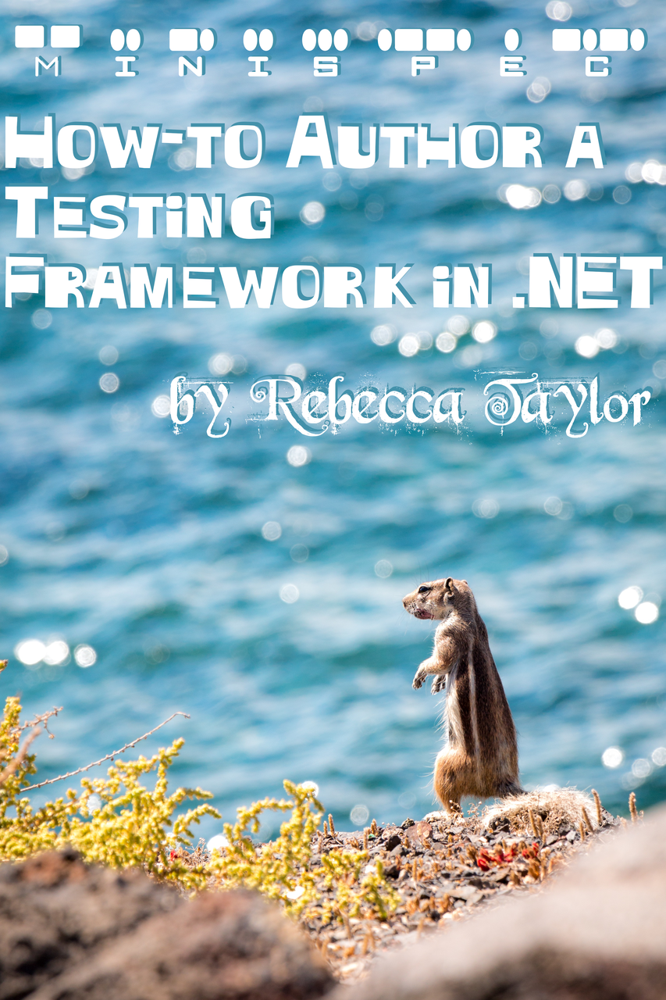

# 🐿️ minispec

> Mini Test Framework for .NET

---

_Coming soon..._

_Currently just using this as a fun C# refresher project!_

---

## MiniSpec Syntax

```cs
using static MiniSpec.Expect; // Optional assertion library

bool TestShouldPass => true;
bool TestShouldFail => false;

void DogTests() {
  var dog = new Dog();

  bool ItCanBark => dog.Bark() == "Woof!"
  bool ItCanEatTreats() {
    var treat = new Treat();
    dog.Eat(treat);
    Expect(treat.Status).ToEqual("Nommed");
  }
}
```

## MiniSpec Tutorial Book

